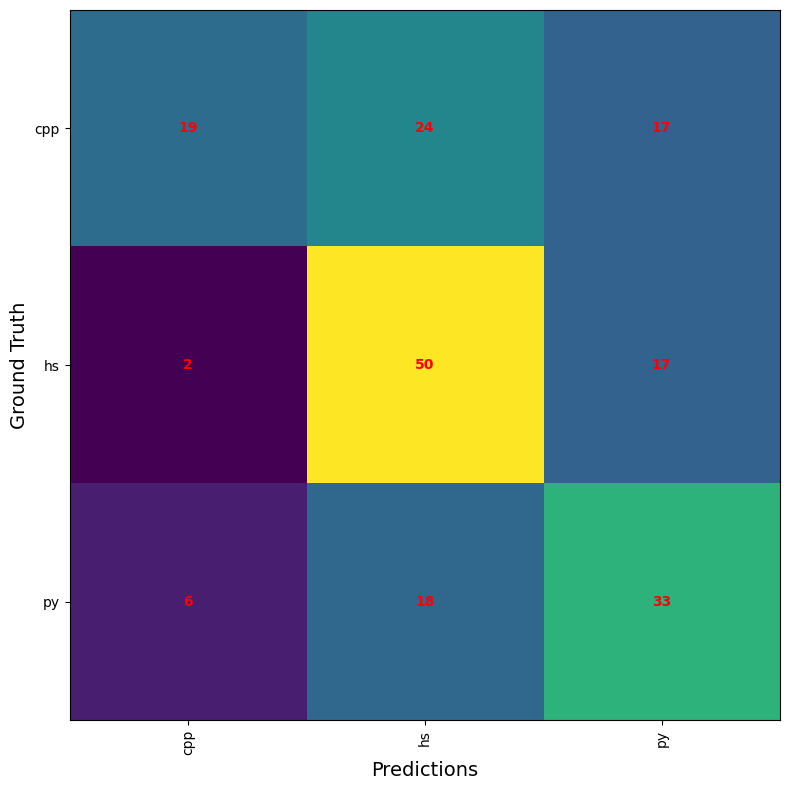

# HEIG_ARN_Projet

## Data Collection Process

Because we couldn't simply use  `bing-image-downloader` for our model application, we had to manually collect code samples. 

The first step was to gather 100 code samples for each of the three programming languages: C++, Python, and Haskell. We sourced these samples from GitHub repositories, which was extremely time-consuming. Each sample needed to be representative of the language's syntax and structure to ensure a comprehensive dataset.

To standardize the visual representation of the code snippets, we developed a script to generate Carbon configurations. Carbon is an online tool that allows to create images of source code. The script was designed to vary syntax highlighting themes, font families, and other parameters, reducing the risk of bias in the model's feature extraction process. This was important to be sure that the model learns to recognize the "essence" of the code rather than visual styles. Applying the configurations and generating images was a manual process. Each of the 300 code samples had to be pasted into Carbon with the specified configurations and saved individually. This manual effort was also very time-consuming.

Initially, we encountered challenges related to the image dimensions required by MobileNet, the CNN architecture chosen for transfer learning. MobileNet mandates input images of 224x224 pixels, whereas our initial images were significantly larger (1360 pixels in width), necessitating resizing. 

We experimented with two methods to achieve the best possible results from our initial data. The first involved extracting images into smaller tiles, allowing the model to detect distinct patterns within the code. The second method involved resizing the original images to leverage the global structure of the code.

## Global architecture

The architecture of our model is designed around MobileNetV2, that serves as the base model, pre-trained on ImageNet.

In our attempts to build an good model, we experimented with a lot of different parameters and configurations. We tested different dense layer setups, like 128 + 32 neurons, 48 + 48 neurons, single dense layers with 128 neurons, and configurations like 96 + 16 neurons. Different dropout rates,  RMSprop and Adam optimizers, we tried to incorporate kernel regularizers, activity regularizers, and bias regularizers to control overfitting. We compared the effectiveness of using GlobalAveragePooling2D() versus Flatten() for transitioning from convolutional layers to dense layers. Additionally, batch sizes of 16 and 32 were tested to find the best fit for our training process. The number of training epochs varied between 4 and 8 to observe how training duration affected model accuracy and loss. We also tried to use ReduceLROnPlateau to adjust the learning rate dynamically based on validation performance.

Among all these experiments, the most significant impact on performance was observed with different amounts of unfrozen layers in the MobileNetV2 base. Given the difference between our code images and the images used to train the ImageNet model, increasing the number of unfrozen layers led to better adaptation and improved performance.

## Method 1: Extracting features from small tiles of code

Our initial approach involved cropping the images to 672x672 pixels and then resizing them to 224x224 pixels. However, this method resulted in poor model accuracy, suggesting that the resized images lost critical detail needed for effective feature extraction.

To address this, we attempted data augmentation to expand our dataset, hypothesizing that the low accuracy might stem from insufficient data samples. Despite multiple fine-tuning attempts, it became clear that the primary issue was not the quantity of data but the quality of the resized images.

To enhance image quality, we adopted a strategy of dividing the original images into 448x448 pixel tiles. This approach maintained higher resolution within smaller sections of the images. Using OpenCV, we calculated the density of code within each tile through canny edge detection, selecting the most representative tiles based on this metric. This method not only preserved image quality but also ensured that the most critical parts of the code snippets were used for model training.

### Model architecture for this method

Following the Flatten layer, we incorporated a dense layer that consists of 128 neurons followed by a dropout layer with a 50% dropout rate. The use of ReLU activation helps the model to learn more complex patterns. The final output layer is a dense layer with a softmax activation function, matching the number of classes in our classification task (C++, Python, and Haskell). 

To optimize the model, we used the Adam optimizer with a learning rate of 0.0001, which combines the advantages of both AdaGrad and RMSProp, making it suitable for this task by adjusting the learning rate dynamically. The loss function utilized is Sparse Categorical Crossentropy, appropriate for our multi-class classification problem where labels are integers.

We experimented with different numbers of unfrozen layers in the MobileNetV2 base. We unfroze varying numbers of the last layers (34, 96 and 123) with the exact same model architecture. This helped us to see if by adapting various features learned from ImageNet to the specific nuances of our code images, had an effect on our model performance.

### Obtained results

#### Re-train 34 layers

#### Re-train 96 layers

#### Re-train 123 layers

### Results evaluation

The provided graphs show the training and validation performance of our model over a number of epochs. From these graphs, we observe a discrepancy between the training and validation curves. The training curves indicate a consistent decrease in loss and an increase in accuracy, suggesting that the model is effectively learning from the training data. However, the validation curves tend to plateau and even increase after a few epochs, while the validation accuracy exhibits a similar plateau effect without improvement. This divergence indicates that the model is not generalizing well and is overfitting to the training data, capturing noise and specific patterns that do not translate to the validation set.

As depicted in the confusion matrices for each experiment, there is a clear trend of improvement with the increased number of unfrozen layers. With each experiment, where more layers were unfrozen, the model's ability to correctly classify the code images improved. This enhancement in performance is likely due to the model's increased capacity to fine-tune its parameters and better capture the features of code images, which are very different from the features present in natural images.

The heatmap image below shows the areas of attention generated by our model when classifying code images. The red regions in these heatmaps indicate the areas where the model is focusing its attention the most. Ideally, we would expect these red dots to align with distinct and meaningful features of the code, such as keywords, operators, and structural elements that are unique to each programming language. However, as observed, the red dots are scattered and often not aligned with these critical features. This misalignment suggests that the model is not effectively capturing the essential characteristics of the code snippets. Instead, it might be focusing on irrelevant parts of the images, leading to poor performance in accurately classifying the code.

### Conclusion

Our experiments and results indicate that the model did not generalize well to the task of classifying code images. This can be attributed to different factors:

1. **Insufficient Fine-Tuning**: Although it is unlikely, as we tried a multitude of different configurations, there is still a possibility that the fine-tuning was not optimal. We experimented extensively with various dense layer configurations, dropout rates, optimizers, regularizers, pooling methods, batch sizes, and learning rates. Despite these efforts, the model did not achieve satisfactory performance, suggesting that fine-tuning alone may not be the solution.
2. **Dataset Differences**: The images in our dataset are very different from those on which MobileNetV2 was originally trained. MobileNetV2 is pre-trained on ImageNet, a dataset comprising **natural** images, whereas our dataset consists of images of code snippets. This domain shift likely hinders the model's ability to effectively transfer learned features from ImageNet to our code images.
3. **Lack of Context in Images**: The 224x224 pixel dimension of the images may not provide enough context for the model to differentiate between the three programming languages. Code snippets often require a broader context to capture distinctive features, such as syntax and structure, which are important for classification. The limited dimensions might restrict the model's ability to perceive the general context of the code, leading to low performance.
4. **Model Suitability**: Convolutional Neural Networks (CNNs) may not be the best model for extracting features from images of text, such as code snippets. CNNs are good at identifying spatial hierarchies and patterns in natural images, but they might not be well-suited for recognizing patterns in textual data presented as images. To improve classification accuracy, it might be beneficial to explore other models or a combination of models better suited for text analysis, such as transformers or recurrent neural networks (RNNs) integrated with CNNs.

## Method 2: Extracting features from global code shape

This method aims to extract the global shape of the code in the images.

### Model architecture for this method

### Obtained results

### Results evaluation

## Conclusion

### Why didn't it work?

### Change model

