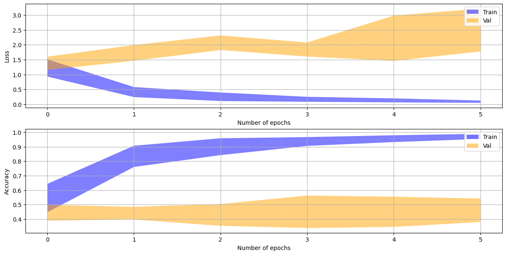
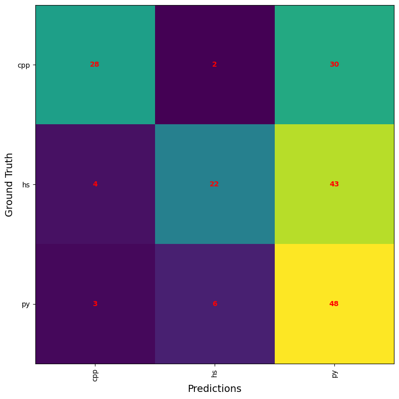
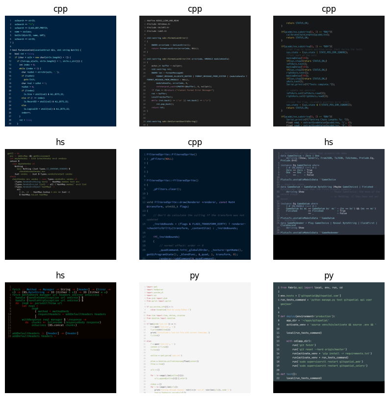
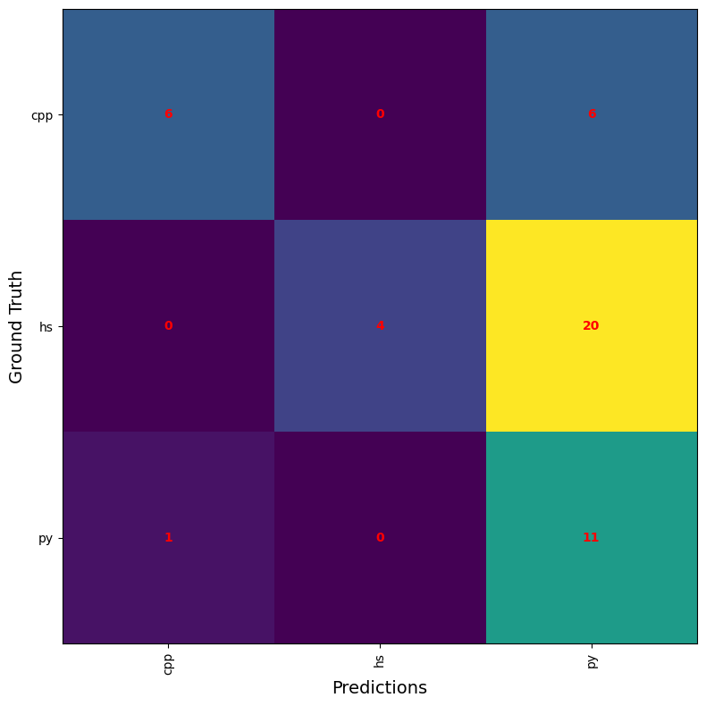
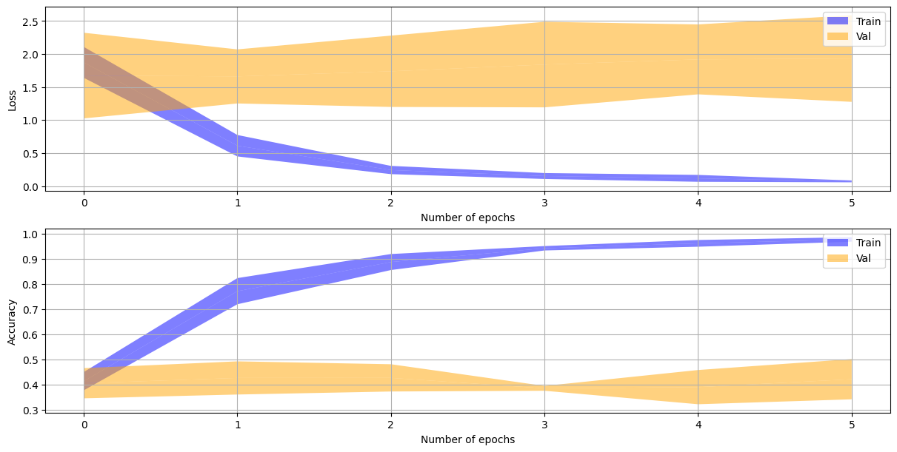

# ARN - PW 5: Object recognition in the wild using Convolutional Neural Networks

**Authors :** Anthony David, JarodStreckeisen, Timothée Van Hove

**Date :** 2024/06/16


## Introduction

In this report, we explore the challenge of classifying code images using CNNs, specifically leveraging the MobileNetV2 architecture through transfer learning. Our goal is to classify three programming languages: C++, Python, and Haskell. Given the nature of code images, which combine textual and structural elements, this task presents challenges compared to traditional image classification.

This practical work aims to evaluate the effectiveness of CNNs in this domain and identify potential areas for improvement in model architecture and training methodology.


## The Problem

The task is to classify code images into three programming languages: C++, Python, and Haskell. We collected a balanced dataset with 100 code samples for each language, sourced from GitHub repositories. The collected images are visually diverse, representing different formatting preferences within each language. 


## Data Collection

We had to manually collect our code samples.  The first step was to gather 100 code samples for each of the three programming languages: C++, Python, and Haskell. We sourced these samples from GitHub repositories, which was extremely time-consuming. Each sample needed to be representative of the language's syntax and structure to ensure a comprehensive dataset.

To standardize the visual representation of the code snippets, we developed a script to generate Carbon configurations. Carbon is an online tool that allows to create images of source code. The script was designed to vary syntax highlighting themes, font families, and other parameters, reducing the risk of bias in the model's feature extraction process. This was important to be sure that the model learns to recognize the "essence" of the code rather than visual styles. Applying the configurations and generating images was a manual process. Each of the 300 code samples had to be pasted into Carbon with the specified configurations and saved individually. This manual effort was also very time-consuming.

We experimented with two methods to achieve the best possible results from our initial data. The first involved extracting images into smaller tiles, allowing the model to detect distinct patterns within the code. The second method involved resizing the original images to leverage the global structure of the code.


## Data Preparation

Each code sample was resized to 224x224 pixels to match the input size required by MobileNetV2. We normalized the pixel values to a range of [0, 1] to standardize the input data. The dataset was split into training and test sets with an 80/20 split, ensuring a balanced distribution of samples across all three classes. We initially encountered challenges related to image dimensions, which necessitated careful resizing and normalization to maintain the quality of the code features.

{width=45%}

## Global architecture

The architecture of our model is designed around MobileNetV2, that serves as the base model, pre-trained on ImageNet.

We chose transfer learning because it could offer some advantages for our problem. Firstly, MobileNetV2 has already learned to extract rich features from images, which can potentially be beneficial even though our domain (code images) differs from the original training domain (natural images). 

Transfer learning is particularly useful for problems with limited data, as it reduces the need for extensive training from scratch. Given that we only had 400 or 100 images per class depending on the experiment, training a deep neural network from scratch would likely result in overfitting and poor generalization. By starting with a pre-trained model, we could maybe achieve better performance with fewer data and computational resources. 

In our attempts to build an good model, we experimented with a lot of different parameters and configurations. We tested different dense layer setups, like 128 + 32 neurons, 48 + 48 neurons, single dense layers with 128 neurons, and configurations like 96 + 16 neurons. Different dropout rates,  RMSprop and Adam optimizers, we tried to incorporate kernel regularizers, activity regularizers, and bias regularizers to control overfitting. We compared the effectiveness of using GlobalAveragePooling2D() versus Flatten() for transitioning from convolutional layers to dense layers. Additionally, batch sizes of 16 and 32 were tested to find the best fit for our training process. The number of training epochs varied between 4 and 8 to observe how training duration affected model accuracy and loss. We also tried to use ReduceLROnPlateau (with RMSprop) to adjust the learning rate dynamically based on validation performance.


## Experiment 1: Extracting features from small tiles of code

Our initial approach involved cropping the images to 672x672 pixels and then resizing them to 224x224 pixels. However, this method resulted in poor model accuracy, suggesting that the resized images lost critical detail needed for effective feature extraction.

To address this, we tried data augmentation to expand our dataset, hypothesizing that the bad accuracy might come from insufficient data samples. Despite multiple fine-tuning attempts, it became clear that the primary issue was not the quantity of data but the quality of the resized images.

To enhance image quality, we tried a strategy of dividing the original images into 448x448 pixel tiles. This approach maintained higher resolution within smaller sections of the images. Using OpenCV, we calculated the density of code within each tile through canny edge detection, selecting the most representative tiles based on this metric. This method not only preserved image quality but also ensured that the most critical parts of the code snippets were used for model training.

Through this process we generated approximately 400 images of each class, giving us a balanced dataset:

````
C++ images generated: 395
Haskell images generated: 404
Python images generated: 395
````


### Experiment 1 model architecture

For this experiments we also had better results with Flatten instead of GlobalAveragePooling, probably because Flatten retains all the spatial information from the convolutional layers, so every feature detected by the convolutional layers is preserved and passed on to the dense layers.

Given the difference between our code images and the images used to train the ImageNet model, increasing the number of unfrozen layers probably lead to slightly better adaptation and improved performance. The output dense layers configuration did not have a significant impact on the overall results.

Following the Flatten layer, we incorporated a dense layer that consists of 128 neurons followed by a dropout layer with a 50% dropout rate. The use of ReLU activation helps the model to learn more complex patterns. The final output layer is a dense layer with a softmax activation function, matching the number of classes in our classification task (C++, Python, and Haskell). 

We used the Adam optimizer with a learning rate of 0.0001, which combines the advantages of both AdaGrad and RMSProp, making it suitable for this task by adjusting the learning rate dynamically. The loss function is Sparse Categorical Crossentropy, appropriate for our multi-class classification problem where labels are integers.

We experimented with different numbers of unfrozen layers in the MobileNetV2 base. We unfroze varying numbers of the last layers (34, 96 and 123) with the exact same model architecture. This helped us to see if by adapting various features learned from ImageNet to the specific nuances of our code images, had an effect on our model performance.

### Experiment 1 obtained results

**Re-train 34 layers**

{width=95%}

{width=60%}

**F1-scores for 34 unfrozen layers**

````
F-score cpp: 0.14705882352941174
F-score hs: 0.4369747899159664
F-score py: 0.5081081081081081
F1 score global: 0.3640472405178288
````


**Re-train 96 layers**

{width=95%}

{width=60%}

**F1-scores for 96 unfrozen layers**

````
F-score cpp: 0.5894736842105264
F-score hs: 0.4444444444444444
F-score py: 0.5393258426966292
F1 score global: 0.5244146571171999
````


**Re-train 123 layers**

{width=95%}

{width=60%}

**F1-scores for 123 unfrozen layers**

````
F-score cpp: 0.4367816091954023
F-score hs: 0.6211180124223603
F-score py: 0.532258064516129
F1 score global: 0.5300525620446305
````


### Experiment 1 results evaluation

The provided graphs show the training and validation performance of our model over a number of epochs. From these graphs, we observe a discrepancy between the training and validation curves. The training curves indicate a consistent decrease in loss and an increase in accuracy, suggesting that the model is effectively learning from the training data. However, the validation curves tend to plateau and even increase after a few epochs, while the validation accuracy exhibits a similar plateau effect without improvement. This divergence indicates that the model is not generalizing well and is overfitting to the training data, capturing noise and specific patterns that do not translate to the validation set.

As we can see in the confusion matrices for each experiment, there is a small trend of improvement with the increased number of unfrozen layers. This enhancement in performance is likely due to the model's increased capacity to fine-tune its parameters and better capture the features of code images, which are very different from the features present in natural images.

The heatmap image below shows the areas of attention generated by our model when classifying code images. The red regions in these heatmaps indicate the areas where the model is focusing its attention the most. Ideally, we would expect these red dots to align with distinct and meaningful features of the code, such as keywords, operators, and structural elements that are unique to each programming language. However, as observed, the red dots are scattered and often not aligned with these critical features. This misalignment suggests that the model is not effectively capturing the essential characteristics of the code snippets. Instead, it might be focusing on irrelevant parts of the images, leading to poor performance in accurately classifying the code.


Our experiments and results indicate that the model did not generalize well to the task of classifying code images. This can be attributed to different factors:

1. Although it is unlikely, as we tried a multitude of different configurations, there is still a possibility that the fine-tuning was not optimal. We experimented with various dense layer configurations, dropout rates, optimizers, regularizers, pooling methods, batch sizes, and learning rates. Despite these efforts, the model did not achieve enough performance, suggesting that fine-tuning alone may not be the solution.
2. The images in our dataset are very different from those on which MobileNetV2 was originally trained. MobileNetV2 is pre-trained on ImageNet, a dataset comprising **natural** images, whereas in our dataset we have images of code snippets. This domain shift probably lower the model's ability to transfer learned features from ImageNet to our code images.
3. The 224x224 pixel dimension of the images may not give enough context for the model to classify the three programming languages. Code snippets needs context to capture features, like syntax and structure, which are important for classification. The limited dimensions might restrict the model's ability to get the general context of the code, leading to low performance.
4. CNNs are probably not be the best model for extracting features from images of text, such as code snippets. They are good for identifying spatial hierarchies and patterns in natural images, but they might not be well-suited for recognizing patterns in text data presented as images. To improve classification accuracy, it might be a good idea to explore other models or a combination of models better suited for text analysis, like transformers or recurrent neural networks (RNNs) integrated with CNNs.

## Experiment 2: Extracting features from global code shape

in our this experiment, we tried to determine whether the model could classify code images based on their global "shape" rather than specific characters or local patterns. This approach focuses on recognizing the overall structure and layout of the code snippets, hypothesizing that the unique formatting and indentation styles might provide sufficient features for classification.

To implement this method, we relied only on the original 300 images generated from the code samples (1360x1360 pixels). These images were directly resized to 224x224 pixels. This resizing process allowed the entire code snippet to fit within the model's input dimensions, providing an overview of each code sample.



### Experiment 2 Model architecture

Again in this experiment we tried different configuration of dense output layers with either one or two layers like (64,64) (48,48) (32,32) (128) (64) with different amount of dropout.

We Finally kept the same model architecture as in the first experiment, including a dense layer with 128 neurons followed by a dropout layer with a 50% dropout rate, and a final output layer with a softmax activation function to classify the three programming languages. We used the Adam optimizer with a learning rate of 0.0001 and Sparse Categorical Crossentropy as the loss function.

As in the previous experiment, we experimented with different numbers of unfrozen layers (34, 96, and 123) to see if the model ability to get global code shapes improved with more layers being fine-tuned.

### Experiment 2 obtained results

**Re-train 123 layers**

{width=95%}

{width=60%}

**F1-scores for 123 unfrozen layers**

````
F-score cpp: 0
F-score hs: 0.2222222222222222
F-score py: 0.4
plot_confusion_matrix(test_confusion_matrix, label_encoder.classes_)
````


**Re-train 96 layers**

{width=95%}

{width=60%}

**F1-scores for 96 unfrozen layers**

````
F-score cpp: 0
F-score hs: 0.2222222222222222
F-score py: 0.4
plot_confusion_matrix(test_confusion_matrix, label_encoder.classes_)
````


**Re-train 34 layers**

{width=95%}

{width=60%}

**F1-scores for 34 unfrozen layers**

````
F-score cpp: 0
F-score hs: 0.2222222222222222
F-score py: 0.4
plot_confusion_matrix(test_confusion_matrix, label_encoder.classes_)
````


### Experiment 2 results evaluation

The graphs above show the training and validation performance over several epochs. It is evident from these graphs that the training process was not effective. While the training loss decreased and accuracy increased, the validation curves showed a plateau, indicating that the model was not learning to generalize well. The validation accuracy remained significantly lower than the training accuracy, and the validation loss plateaued early, showing the model's struggles to capture patterns from the validation data.

In the heatmap below, we can see that the red dots, indicating areas of attention, are dispersed quasi-randomly across the images. In many cases, these red dots do not align with the code, instead focusing on blank areas of the images. This random dispersion indicate that the model failed to identify any coherent patterns or features that could differentiate the programming languages based on their global shape.

One possible reason for this failure is that the distribution of code in the images is not an effective metric for classification. The global layout of code can vary significantly depending on individual coding styles, such as the length of variable names, the use of one-liners, and other stylistic preferences. These variations introduce a high degree of inconsistency, making it difficult for the model to learn generalized patterns that are representative of each programming language.


{width=75%}


## Real-world tests

We conducted those tests with the architecture based on the first experiment because we had better results with it.

Initially, we faced significant difficulties in exporting our model weights to the TensorFlow Lite format. Using TensorFlow version 2.16.1, the execution of the code to convert and save the model frequently caused the kernel to crash. Furthermore, attempts to install TensorFlow version 2.15.0 on Windows were unsuccessful. Additionally, some of our Linux machines encountered issues where the `tflite-support` library could not be installed at all, preventing us from creating the required .tflite file.

Despite these challenges, we successfully exported the model weights and labels, placing them in the appropriate directory within the Android Studio project.

#### Results of Real-World Testing

When deploying the application on mobile devices and testing it with the camera, the model's performance was suboptimal. 

**Non-Code Images**: The model systematically interpreted non-code images as belonging to the Haskell (hs) class. This behavior is likely due to the model's inability to recognize features outside of the training data, defaulting to the hs class when it encounters unfamiliar input.

**Code Images**: When presented with actual code images, the model's predictions were inconsistent, alternating randomly between the C++ (cpp) and Python (py) classes. Adjusting the distance of the camera to the code snippets did not stabilize the model's predictions, indicating a lack of reliable feature extraction.


This result is not surprising given the performance of our model during training and validation phases. As mentioned earlier in the report, our model struggles to generalize well to unseen data. The real-world testing further confirmed that the model's current architecture and training were insufficient for robust and reliable classification of code snippets in varied conditions.

## Conclusion

The consistent underperformance across both experiments can be attributed to several factors:

1. CNNs are good at capturing spatial hierarchies and patterns in natural images, but they are probably not usable for identifying the specific patterns inherent to different programming languages in code snippets. The semantic information in the nature of code is probably lost when converting to and resizing images, blocking the model ability to classify languages.
2. Code snippets have a lot of variability within the same class because of differences in coding styles, indentation, and formatting. This "intra-class variability" makes it difficult for our model to learn coherent patterns that can represent each language, resulting in bad generalization.
3. Programming languages needs an understanding of the context to identify their syntax. The low dimensions of the resized images can probably not give enough context for the model to identify the 3 different languages based on their structural features.
4. CNNs, are powerful for image classification tasks, but they are certainly not a good choice for classifying images of code. The  syntactic structures in code are not easily captured by the spatial filters of CNNs. Alternative models, such as transformers or hybrid models combining CNNs with recurrent neural networks, might be a better choice for this kind of applications.

### Dataset Improvement Suggestions

Based on the results, we suggest collecting more diverse code samples, explore more preprocessing techniques to enhance feature extraction. Increasing the dataset size and diversity may help the model learn more significant features.

In conclusion, our experiments shows the difficulty of using CNNs for classifying code images and show that alternative approaches should be explored.


